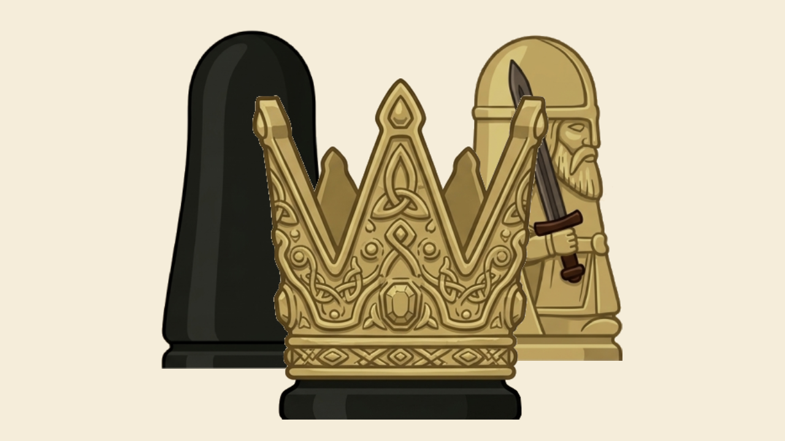

# Hnefatafl - The Viking Game 🛡️⚔️

Welcome to **Hnefatafl**, an ancient Nordic board game of strategy and skill. Often referred to as "The Viking Game," Hnefatafl pits a large attacking army against a smaller group of defenders protecting their King.



## 🎮 Game Overview

Hnefatafl is an asymmetrical strategy game. One player controls the **Attackers** (the dark army), while the other controls the **Defenders** (the light army) and the **King**.

- **Board Size**: 9x9 grid.
- **Starting Position**: The King starts on the central square (The Throne), surrounded by his defenders. The attackers start at the edges of the board.

---

## 📜 How to Play

### 🚶 Movement

- **Rook-like Movement**: All pieces (Attackers, Defenders, and the King) move any number of empty squares horizontally or vertically.
- **No Jumping**: Pieces cannot jump over other pieces.
- **Restricted Squares**: Only the **King** can land on the central square (**The Throne**) or the four **Corner Squares**. Other pieces can pass through the Throne if it is empty, but they cannot stop there.

### ⚔️ Capturing

- **Soldiers**: A piece is captured and removed from the board if it is "sandwiched" between two enemy pieces on opposite sides (horizontally or vertically).
- **Hostile Squares**: The Throne and the four Corner Squares act as hostile squares. You can capture an enemy by pinning them between your piece and one of these special squares.
- **The King**: The King is more resilient. He can only be captured if he is surrounded on all four sides by attackers. If he is adjacent to the Throne or a Corner, he can be captured with fewer attackers (3 or 2) depending on his position.

---

## 🏆 Winning Conditions

| Side          | Objective                                                         |
| :------------ | :---------------------------------------------------------------- |
| **Defenders** | The King must reach any of the four **Corner Squares** to escape. |
| **Attackers** | Surround and capture the **King** before he escapes.              |

---

## ✨ Features

- **Smooth GUI**: Built with Python and Tkinter for a classic desktop experience.
- **Single Player vs AI**: Challenge a computer opponent with three difficulty levels (**Easy**, **Medium**, **Hard**).
- **Local Multiplayer**: Play with a friend on the same computer.
- **Atmospheric Audio**: Background music and sound effects to immerse you in the Viking atmosphere.

---

## 🚀 Installation & Running

### Prerequisites

Ensure you have **Python 3.x** installed on your system.

### Running the Game

1. Clone the repository or download the source code.
2. Install the necessary dependencies (if not already installed):
   ```bash
   pip install Pillow
   pip install cairosvg
   pip install svglib
   pip install reportlab
   ```
3. Run the game by executing the following command from the root directory:
   ```bash
   python home.py
   ```

---

## 👥 Contributors

This project was developed by a team of dedicated individuals:

- **[Marwan Hussein](https://github.com/Marwan-Hussein)** - UI designer / GUI
- **[Ahmed Abdellatef](https://github.com/Ahmed-3bdellatif)** - Controllers
- **[Youssef Hossam](https://github.com/yousefjjoooo)** - Core logic in Python/prolog
- **[Abdo Emam](https://github.com/Abd-elrahman10)** - Core logic in Python

---

## 📜 License

This project is licensed under the MIT License - see the [LICENSE](LICENSE) file for details.
